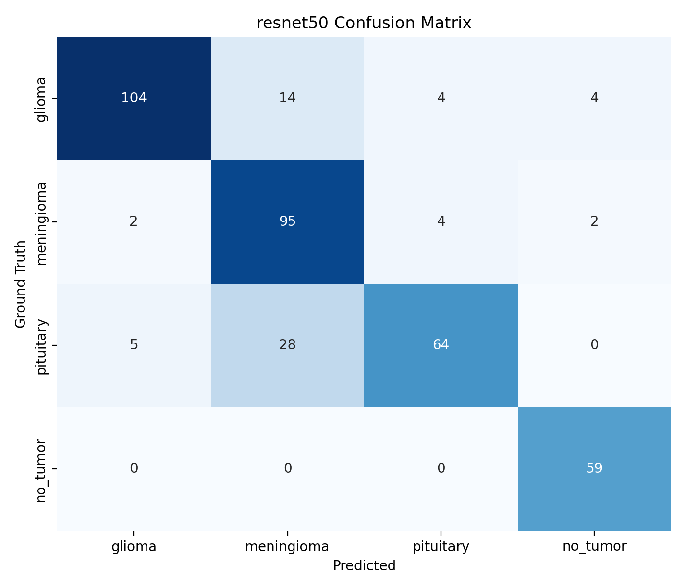
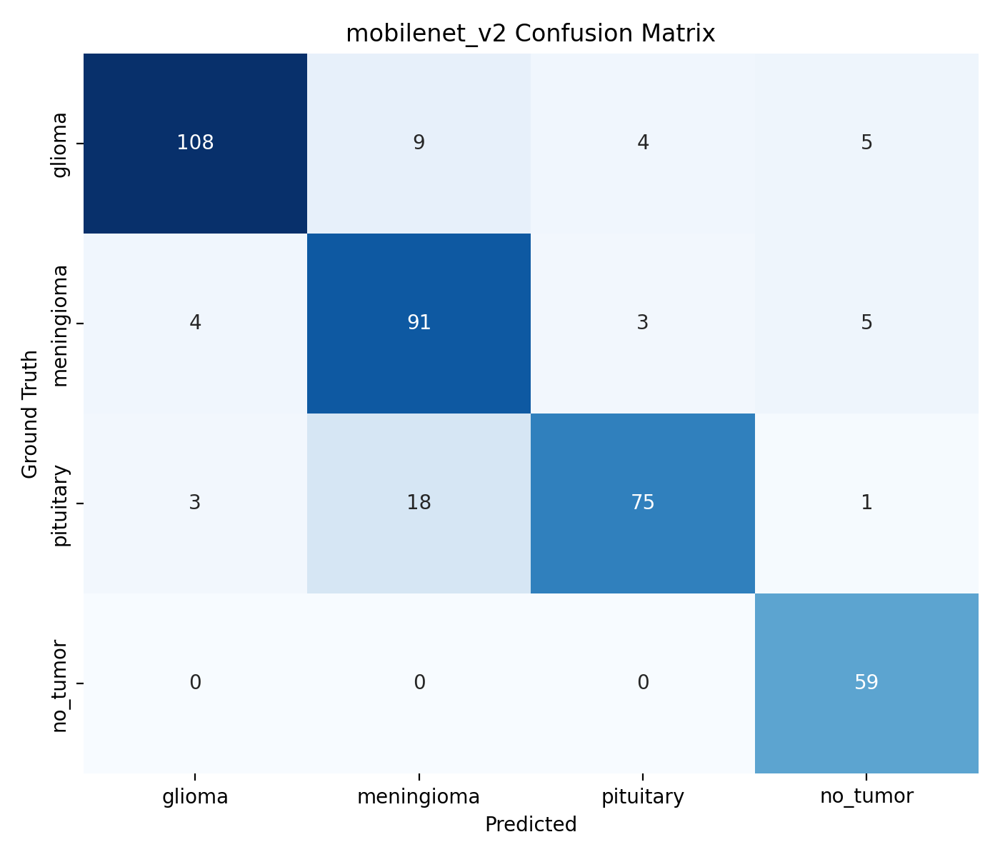

# Brain Tumor Detection Pipeline

A decoupled multi-stage deep learning pipeline for automated brain tumor detection and classification from MRI scans. The system physically isolates the tumor region before classification, eliminating the background noise bottleneck present in monolithic single-pass architectures.

---

## Pipeline Overview

```
MRI Scan (640×640 RGB)
        │
        ▼
┌───────────────────┐
│  YOLOv11 + CBAM   │  ← Tumor localization
│  (Localization)   │     CBAM suppresses healthy tissue noise
└───────────────────┘
        │
        ├── No detection → Label: "No Tumor"
        │
        ▼
┌───────────────────┐
│   Padded ROI      │  ← 10% padding around bbox
│   Cropping        │     Crop resized to 224×224
└───────────────────┘
        │
        ▼
┌───────────────────────────────────────┐
│  ResNet50 │ MobileNetV2 │ EfficientB0 │  ← Transfer learning
│           Classification              │     Two-stage fine-tuning
└───────────────────────────────────────┘
        │
        ▼
  Glioma │ Meningioma │ Pituitary │ No Tumor
```

---

## Key Features

- **Decoupled architecture**: localization and classification are separate, independently optimized stages
- **CBAM attention**: inserted into YOLOv11 neck (PAN layers 16, 19, 22) to suppress healthy brain tissue and skull noise
- **Padded ROI cropping**: 10% bbox padding preserves tumor boundary context before classification
- **Three classifiers**: ResNet50 (primary), MobileNetV2, EfficientNetB0 trained on identical ROI crops for fair comparison
- **Two-stage transfer learning**: frozen head training (Stage 1: 15 epochs) followed by selective top-2 block unfreezing at a lower learning rate (Stage 2: 40 epochs)
- **Class imbalance handling**: weighted cross-entropy loss compensating for the minority No Tumor class (592 vs 1116–1378 samples)
- **Bayesian hyperparameter optimization**: Optuna search over learning rate, dropout, and batch size (15 trials per classifier)
- **Grad-CAM explainability**: heatmap visualizations confirming classifiers attend to the tumor region
- **Direct benchmarking**: results compared against studies from the literature survey

---

## Dataset

**Source:** [Brain Tumor MRI — Roboflow Universe](https://universe.roboflow.com/eksperiment/brain-tumor-mri-ycidy)

<div style="display: flex; gap: 2rem;">

<table>
<tr><th>Split</th><th>Images</th></tr>
<tr><td>Train</td><td>2,444 (62.6%)</td></tr>
<tr><td>Validation</td><td>1,074 (27.5%)</td></tr>
<tr><td>Test</td><td>385 (9.9%)</td></tr>
<tr><td><strong>Total</strong></td><td><strong>3,903</strong></td></tr>
</table>

<table>
<tr><th>Class</th><th>Count</th></tr>
<tr><td>Glioma</td><td>1,321</td></tr>
<tr><td>Meningioma</td><td>1,378</td></tr>
<tr><td>Pituitary</td><td>1,116</td></tr>
<tr><td>No Tumor</td><td>592</td></tr>
</table>

</div>

All images are pre-resized to **640×640 RGB** by Roboflow. YOLO annotation format (normalized `.txt` labels per image).

---

## Project Structure

```
brain-tumor-detection-pipeline/
│
├── main.py                  # Global config, Optuna, pipeline execution controller
├── data.py                  # Dataset classes, preprocessing, augmentation, class weights
├── pipeline.py              # All model classes and pipeline orchestrator
├── results_manager.py       # Metrics, plots, Grad-CAM, benchmarking
│
├── dataset/                 # Original Roboflow dataset (YOLO format)
│   ├── train/
│   │   ├── images/
│   │   └── labels/
│   ├── valid/
│   │   ├── images/
│   │   └── labels/
│   └── test/
│       ├── images/
│       └── labels/
│
├── roi_dataset/             # Auto-generated — split-aligned 224×224 crops
│   ├── train/
│   │   ├── glioma/
│   │   ├── meningioma/
│   │   ├── pituitary/
│   │   └── no_tumor/
│   ├── valid/
│   └── test/
│
├── weights/                 # Saved model weights
└── results/                 # Output plots, metrics, Grad-CAM images
```

> **Note:** `roi_dataset/` is generated once from the final trained YOLO model. Set `force_rebuild_roi: False` in CONFIG to skip rebuilding on subsequent runs. This ensures classifier training is always reproducible.

---

## Installation

```bash
git clone https://github.com/AbdulrahmanQht/brain-tumor-detection-pipeline
cd brain-tumor-detection-pipeline
pip install -r requirements.txt
```

---

## Usage

### 1. Configure

Edit the `CONFIG` dictionary in `main.py` to set your dataset path and adjust hyperparameters.

### 2. Run full pipeline

```bash
python main.py
```

This executes all stages in order:

1. Load and preprocess dataset
2. Train YOLOv11 + CBAM (stops at mAP@0.5:0.95 plateau, patience = 30 epochs)
3. Build ROI dataset from final YOLO weights (split-aligned, one-time)
4. Run Optuna hyperparameter search (per classifier, 15 trials each)
5. Train all three classifiers using two-stage transfer learning with each classifier's own best Optuna params
6. Run pipeline on test set
7. Generate all evaluation metrics, plots, and Grad-CAM visualizations
8. Output benchmark comparison table

### 3. Key CONFIG flags

#### Stage control
| Flag | Default | Description |
|---|---|---|
| `train_yolo` | `True` | Train YOLO from scratch (set True for first run) |
| `build_roi_dataset` | `True` | Rebuild ROI crops from YOLO predictions |
| `force_rebuild_roi` | `True` | Delete and regenerate existing ROI dataset |
| `train_classifiers` | `True` | Train all three classifiers |
| `run_pipeline_on_test` | `True` | Run full pipeline on test split |
| `run_optuna` | `True` | Enable Bayesian hyperparameter search |
| `run_gradcam` | `True` | Generate Grad-CAM heatmaps after evaluation |

#### YOLO
| Flag | Default | Description |
|---|---|---|
| `yolo_epochs` | `150` | Maximum training epochs |
| `yolo_patience` | `30` | Early stopping patience (epochs without mAP improvement) |
| `yolo_conf_thresh` | `0.45` | Minimum detection confidence |
| `yolo_iou_thresh` | `0.50` | NMS IoU threshold |
| `no_tumor_fallback` | `True` | No YOLO detection → classify as No Tumor |

#### Classifiers
| Flag | Default | Description |
|---|---|---|
| `head_epochs` | `15` | Stage 1: frozen backbone training epochs |
| `finetune_epochs` | `45` | Stage 2: top-2 block fine-tuning epochs |
| `learning_rate` | `5e-4` | Stage 1 learning rate |
| `learning_rate_ft` | `8e-6` | Stage 2 fine-tuning learning rate |
| `batch_size` | `32` | Training batch size (overridden by Optuna if enabled) |
| `dropout_rate` | `0.4` | Classifier head dropout (overridden by Optuna if enabled) |
| `classifier_early_stopping_patience` | `7` | Early stopping patience for classifiers |
| `optuna_trials` | `10` | Number of Optuna trials per classifier |

---

## Evaluation Metrics

**Localization (YOLO):**
- Intersection over Union (IoU)
- mAP@0.5 and mAP@0.5:0.95 ← primary stopping criterion

**Classification (per classifier, per class):**
- Accuracy, Precision, Recall, F1-Score
- Confusion matrix

**Outputs saved to `results/`:**
- Confusion matrices (one per classifier)
- Training loss and accuracy curves (Stage 1 and Stage 2 separately)
- Before/After sample images (original 640×640 scan → 224×224 ROI crop)
- Comparative table: ResNet50 vs MobileNetV2 vs EfficientNetB0
- Grad-CAM heatmaps on sample test ROIs
- Benchmark table vs literature

---

## Technical Details

| Component | Detail |
|---|---|
| Detector | YOLOv11n with CBAM in PAN neck (C2fCBAM at head layers 16, 19, 22) |
| YOLO architecture file | `yolo11n-cbam.yaml` |
| YOLO stopping criterion | mAP@0.5:0.95 plateau (patience = 30 epochs) |
| ROI padding | 10% of bbox width/height on each side |
| Classifiers | ResNet50, MobileNetV2, EfficientNetB0 |
| Transfer learning | ImageNet pretrained → frozen head training (15 ep, lr=5e-5) → top-2 block fine-tuning (40 ep, lr=3e-6) |
| Optimizer | Adam |
| Loss | Weighted cross-entropy (class weights computed from training split only) |
| Hyperparameter search | Optuna — Bayesian optimization, 15 trials per classifier; LR search range: 1e-4 → 1e-3 |
| XAI | Grad-CAM on final conv layer of each classifier |
| Input size (YOLO) | 640×640 RGB |
| Input size (classifiers) | 224×224 RGB, ImageNet normalized |

---

## Results
 
### Localization — YOLOv11 + CBAM (Test Set)
 
| Metric | Value |
|---|---|
| Peak mAP@0.5 | **0.9341** (epoch 111) |
| Peak mAP@0.5:0.95 | **0.7119** (epoch 133) |
| Mean IoU | **0.8256** |
| Detection Rate | **98.2%** (320 / 326 targets) |
| Total Epochs | 150 |
 
---
 
### Classification — Validation Set Summary
 
| Model | Accuracy | Macro F1 | Weighted F1 |
|---|---|---|---|
| ResNet50 | 84.6% | 0.8614 | 0.8468 |
| MobileNetV2 | **86.4%** | **0.8718** | **0.8635** |
| EfficientNetB0 | 84.3% | 0.8536 | 0.8417 |
 
---
 
### Classification — Test Set Summary
 
| Model | Accuracy | Macro F1 | Weighted F1 |
|---|---|---|---|
| ResNet50 | 83.6% | 0.8446 | 0.8357 |
| **MobileNetV2** | **86.5%** | **0.8681** | **0.8650** |
| EfficientNetB0 | 81.8% | 0.8225 | 0.8168 |
 
MobileNetV2 achieves the best performance across all metrics on both validation and test splits.
 
---
 
### Classification — Per-Class Test Results
 
#### ResNet50
 
| Class | Precision | Recall | F1 | Support |
|---|---|---|---|---|
| Glioma | 0.937 | 0.825 | 0.878 | 126 |
| Meningioma | 0.693 | 0.922 | 0.792 | 103 |
| Pituitary | 0.889 | 0.660 | 0.757 | 97 |
| No Tumor | 0.908 | 1.000 | 0.952 | 59 |
| **Macro Avg** | **0.857** | **0.852** | **0.845** | 385 |
 

 
#### MobileNetV2
 
| Class | Precision | Recall | F1 | Support |
|---|---|---|---|---|
| Glioma | 0.939 | 0.857 | 0.896 | 126 |
| Meningioma | 0.771 | 0.883 | 0.824 | 103 |
| Pituitary | 0.915 | 0.773 | 0.838 | 97 |
| No Tumor | 0.843 | 1.000 | 0.915 | 59 |
| **Macro Avg** | **0.867** | **0.878** | **0.868** | 385 |
 

 
#### EfficientNetB0
 
| Class | Precision | Recall | F1 | Support |
|---|---|---|---|---|
| Glioma | 0.841 | 0.841 | 0.841 | 126 |
| Meningioma | 0.750 | 0.786 | 0.768 | 103 |
| Pituitary | 0.886 | 0.722 | 0.795 | 97 |
| No Tumor | 0.806 | 0.983 | 0.885 | 59 |
| **Macro Avg** | **0.821** | **0.833** | **0.822** | 385 |
 

 
---
 
### Optuna Best Hyperparameters
 
| Model | LR (Stage 1) | LR (Stage 2) | Dropout | Batch Size | Best Val Acc |
|---|---|---|---|---|---|
| ResNet50 | 3.36e-4 | 4.20e-5 | 0.358 | 32 | 84.8% |
| MobileNetV2 | 2.07e-4 | 4.96e-5 | 0.563 | 16 | **87.5%** |
| EfficientNetB0 | 3.01e-4 | 2.50e-5 | 0.397 | 16 | 85.3% |
 
---
 

## Course

CS 522 — Selected Topics in Computer Science  
Imam Abdulrahman Bin Faisal University, Department of Computer Science